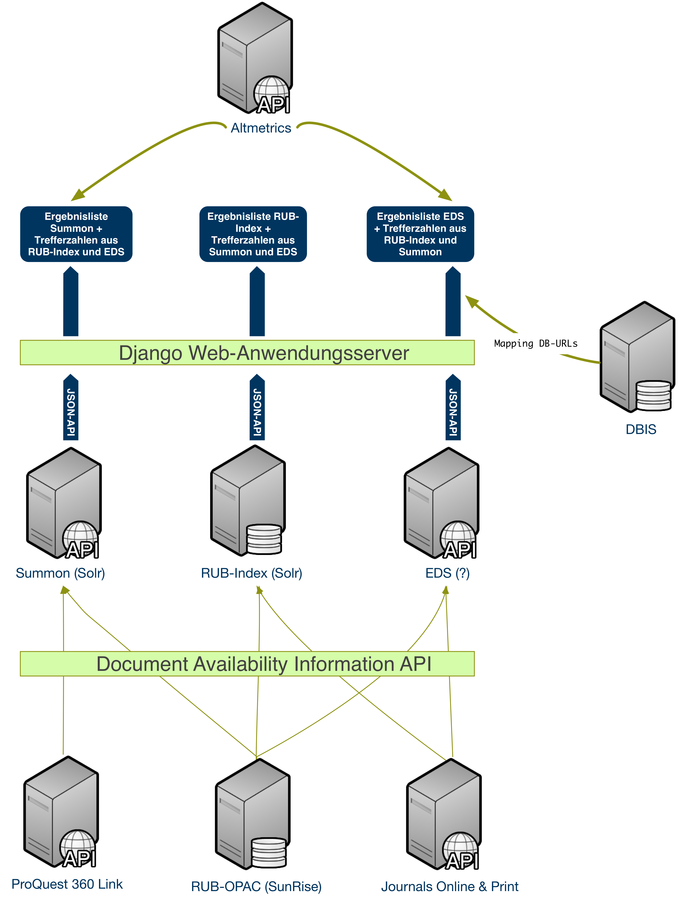
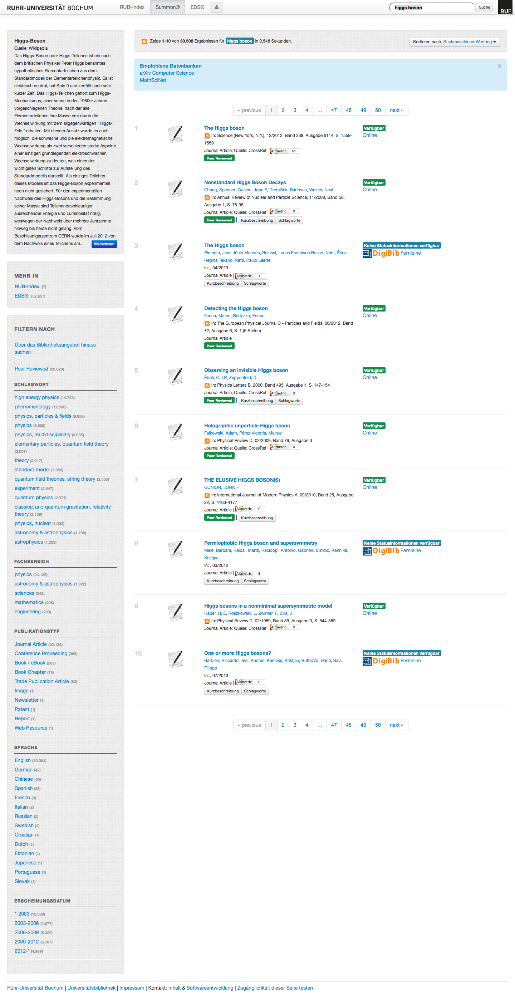
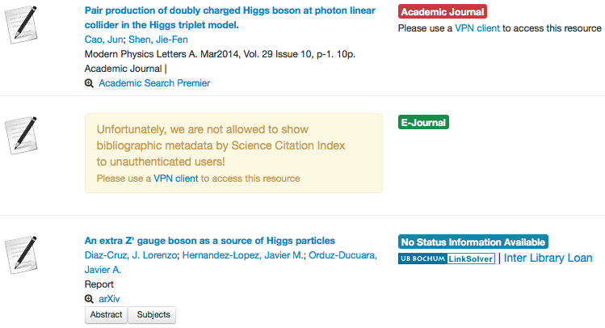

# "suchen" -- Ein Prototyp zum Vergleich von Discovery-Diensten

André Hagenbruch  
Universitätsbibliothek Bochum  
44780 Bochum  
andre.hagenbruch@rub.de

Miriam Heise  
Universitätsbibliothek Bochum  
44780 Bochum  
miriam.heise@rub.de

## Zusammenfassung

## Abstract
We describe a prototype web application that integrates two different discovery systems and an OPAC based search index.

### Schlüsselwörter
Discovery-Dienst,

### Keywords
Discovery Service,

## Einleitung
Im Mai 2008 startete die Universitätsbibliothek Bochum das Projekt "Integriertes Bibliotheksportal", in dem eine Anwendung
entstehen sollte, um den Benutzern möglichst viele Datenquellen unter einer einheitlichen Oberfläche zur Recherche
auf Basis moderner Suchmaschinentechnologie anbieten zu können. Darüber hinaus sollte die Anwendung auch den
aktuellen Verfügbarkeitsstatus des jeweiligen Titels anzeigen und Benutzerfunktionalitäten wie z.B. Vormerkungen oder
Kontoverwaltung ermöglichen. Während wir zunächst intensiv OCLC TouchPoint evaluiert haben, zeichnete es sich ab,
dass wir damit nicht alle unsere Ziele erreichen würden. Parallel zu diesem Projekt haben wir eine auf Open Source
Software basierende Such-Plattform für die Hochschulbibliographie der RUB entwickelt, die so konzipiert war, dass 
mit geringen Anpassungen unterschiedliche Datenquellen integriert werden konnten. Im September 2011 testeten wir mit
ProQuest zum ersten Mal die Möglichkeit, einen Discovery-Dienst in diese Plattform zu integrieren. Da ein Demonstrator
recht schnell implementiert werden konnte, entschlossen wir uns, die Produkte Summon von ProQuest und EDS von Ebsco
durch Integration über die angebotenen APIs sowie einen Suchmaschinenindex mit unseren Katalogdaten nebeneinander
zu evaluieren.  

Im Folgenden werden wir die Architektur unseres Protoyps beschreiben, die angebotenen APIs und Metadaten und auch die
Erfahrungen, welche die UB-Mitarbeiter und die regulären Bibliotheksbenutzer mit diesen Diensten gemacht haben.

## Technische Architektur
Da es sich bei den Discovery-Diensten um Anwendungen handelt, die auf aktueller Suchmaschinentechnologie basieren,
werden die Daten des Bochumer OPAC in einem täglich ablaufenden ETL-Prozess in eine Apache Solr-Instanz überführt.
Während Summon ebenfalls Solr als Plattform benutzt, gibt es von Ebsco keine konkreten Informationen über die
eingesetzte Technik. Da bei ProQuest an dieser Stelle Open Source-Software zum Einsatz kommt, kann man als Kunde gut den
zu erwartenden Funktionsumfang der Plattform abschätzen, da sie sowohl im Web als auch in der Literatur ausführlich
dokumentiert ist.  
Sowohl Summon als auch EDS bieten ihren Kunden die Wahl zwischen der Nutzung als SaaS (_Software as a Service_), bei dem
die Webanwendung bei den Firmen gehostet wird und nur in geringem Umfang an die lokalen Bedürfnisse (sowohl in Bezug auf
das Layout als auch die Funktionalitäten) angepasst werden kann, und der Einbindung des Dienstes über eine API
(_Application Programming Interface_). Da auch die Testumgebung möglichst neutral gestaltet werden sollte, wurde die
letztere Möglichkeit gewaählt. Kernstück der Architektur ist ein Django Webapplikationsserver, der sowohl die Discovery
Dienste als auch den lokalen Index anspricht. Für das Oberfächenlayout kommt das CSS-Framework _Bootstrap_[^1] in einer
nur rudimentär an das Corporate Design der Ruhr-Universität Bochum angepassten Form zum Einsatz. Darüber hinaus stellt
ein weiterer Django-Server eine Implementierung der _Document Availability Information API_ (DAIA)[^2] zur Verfügung,
die sowohl Verfügbarkeitsinformationen aus dem Lokalsystem als auch aus dem _Journals Online & Print_ (JOP)-Dienst der
DNB als auch dem 360 Link-Resolver von ProQuest hinter dieser plattformneutralen Programmierschnittstelle kapselt. Ist
nicht möglich, über diese Dienste die Verfügbarkeit eines Titels zu ermitteln, wird anhand der in den APIs enthaltenen
OpenURL-Informationen ein Link zur Fernleihe der DigiBib erzeugt.
Damit soll den BenutzerInnen sofort die Möglichkeit gegeben werden, anhand der Verfügbarkeit über die Relevanz eines
Treffers zu entscheiden, ob der Titel relevant ist. Eine weitere Entscheidungshilfe über die Relevanz des Treffers wird
über die Integration des Dienstes _Altmetric_[^3] zu geben versucht, der Metriken über die Verwendung eines Artikels im
Web aggregiert.  

Ein weiteres Desiderat dieses Tests sah vor, dass die Ergebnisse aus den Suchen in den Discover-Diensten untereinander aber
auch zu unserem OPAC vergleichbar sein sollten. Daher haben wir die Trefferlisten so modelliert, dass eine Anfrage in
eines der drei Systeme die Trefferanzahl der jeweils anderen beiden sowie einen Link mit der Suchanfrage in den
jeweiligen Dienst lieferte. Dabei haben wir uns auf die reine Zeichenkette der Benutzeranfrage beschränkt, da die
Navigatoren der drei Systeme nicht aufeinander abbildbar waren. Während unser lokaler Index über Navigatoren über
Personen und Körperschaften verfügt, die sich aus der GND speisen, bot keiner der beiden Discovery-Dienste diese
Kategorien an, zumal in keinen von ihnen Normdaten integriert sind. Ein hilfreicher Navigator, den bei Dienste anbieten,
ist die Möglichkeit, die Treffermenge auf _peer reviewed_-Artikel einschränken zu können. Da Summon diese Kategorie
auch in den einzelnen Datensätzen anbietet, konnte diese Information auch prominent in den Treffern der Ergebnisliste
dargestellt werden. Summon bietet darüber hinaus die Möglichkeit, enzyklopädische Informationen -- aus der Encyclopedia
Britannica oder der Wikipedia -- in die Trefferliste zu integrieren. EDS zog diese Funktionalität zum Ende unserer
Testperiode mit den _Research Starters_ nach, jedoch fehlte uns die Zeit, diese zu implementieren und zu testen. Da in
EDS die Zugehörigkeit eines Datensatzes zu der Datenbank, aus der er stammt, abzulesen ist, haben wir anhand des
Datenbanktitels ein semi-automatisches Mapping der Titel auf die URLs aus DBIS erstellt, sodass ein Benutzer sofort in
der jeweiligen Datenbank weiterrecherchieren kann. Da die Discovery-Dienste für sich in Anspruch nehmen, mit einer
Google-artigen Ein-Schlitz-Suche sehr gute Ergebnisse zu erzielen, haben wir auf die Implementierung einer erweiterten
Suche verzichtet.

## Metadaten und APIs
ProQuest bezieht seine bibliographischen Daten direkt von den Verlagen, die bibliographischen Daten in EDS hingegen
stammen von Datenbankanbietern, woraus sich einerseits Unterschiede im Umgang mit den Metadaten ergeben, anderseits
schlägt sich dieser Umstand in zwei unterschiedlichen lizenzrechtlichen Modellen nieder. ProQuest setzt ein sogenanntes
Match-&-Merge-Verfahren ein, bei dem Dubletten von Titeldatensätzen verschiedener Anbieter zu einem einzigen Datensatz
verschmolzen und dadurch angereichert werden. In EDS bleiben die Dubletten im Index nebeneinander bestehen, den Nutzern
wird der umfangreichste Datensatz geliefert. ProQuest setzt also darauf, möglichst viele Informationen zu einem Titel in
einem Datensatz zu vereinen, Ebsco indes legt Wert darauf, dass die Integrität der Datensätze erhalten bleibt und diese
so angezeigt werden wie in den Datenbanken, aus denen sie stammen. Bei diesem Vorgehen besteht zwar die Möglichkeit, vom
Titel direkt in die entsprechende Datenbank zu wechseln, andererseits entgehen den Nutzern Informationen (z.B.
Schlagwörter), die sich nicht beim umfangreichsten Titel befinden und somit nicht angezeigt werden.
ProQuest ermöglicht seinen Nutzern im Übrigen durch passend zur Suchanfrage generierte Datenbankvorschläge den Übergang
in Datenbankangebote.  
Aus dem unterschiedlichen Umgang der beiden Discovery-Anbieter mit den Metadaten ergeben sich auch lizenzrechtliche
Konsequenzen für die Nutzer dieser Angebote: Während die Metadaten in den Ergebnislisten in Summon vollständig angezeigt
werden, sodass die Nutzer sofort und auf einen Blick ihr Suchergebnis bewerten können, werden die Trefferlisten in EDS
unter Umständen nur authentifizierten Nutzern vollständig angezeigt. Technisch wäre die Anzeige der Metadaten in EDS
problemlos möglich, allein aufgrund vertraglicher Vereinbarungen sehen Nutzer, die nicht durch Authentifizierung oder
aufgrund ihrer IP-Adresse autorisiert sind, lediglich Stellvertreter anstelle der Titeldaten, was den
Benutzererwartungen an Suchanwendungen entgegen läuft.  
  
Während sowohl Summon als auch für EDS eine REST-basierte API anbieten, deren Daten im XML- bzw. im JSON-Format
ausgegeben werden, besteht der grundlegende Unterschied zwischen diesen beiden Angeboten darin, dass die
Summon-Webanwendung vollständig auf der API beruht, während die EDS-Oberfläche eine von den Programmierschnittstellen
losgelöste Entwicklung darstellt.  
Während die Dokumentation der Summon-API vollständig im Web für jedermann einsehbar ist und dort sehr übersichtlich die
Komponenten und Parameter beschreibt, ist die EDS-API-Dokumentation nur Kunden zugänglich. Sie gliedert sich in zwei
Dokumente, eine großflächige Übersicht und eine Referenz, die zwar detailliert über die Parameter Auskunft gibt, nicht
jedoch über die Benennungen der im Index vorhandenen Felder, was dazu führte, dass wir erst im Laufe unserer
Implementierung durch Anschauung der konkreten Daten herausfinden konnte, in welchen Kategorien welche Werte zu
erwarten waren. Wenig hilfreich war in diesem Zusammenhang, dass ein und dieselbe Kategorie mehrere Labels haben kann.
Ein Pluspunkt gegenüber der Summon-Dokumentation stellt die API-Console[^4] dar, in der man unterschiedlichste Anfragen
ausprobieren kann.  
Problematisch ist an der EDS-API allerdings, dass es vier Detailgrade bezüglich des Umfangs der Feldstruktur eines
Datensatzes gibt: „Title“ (nur der Titel), „Brief“ (Titel, Quelle und Schlagwörter) und „Detailed“ (Brief plus Abstract).
Während diese drei Ebenen der „Search“-Funktion der Ergebnisliste vorbehalten sind, gibt es den
vollumfänglichen Datensatz nur mit  der „Retrieve“-Funktion, die für die Volltrefferanzeige genutzt wird. Eine solche 
Unterscheidung gibt es in Summon nicht: Dort ist schon in der Ergebnisliste jeder Treffer im vollen Umfang enthalten, 
weshalb sich dadurch Oberflächen implementieren lassen, die ohne eine eigene Volltrefferanzeige auskommen. Das Fehlen 
einer einheitlichen Feldstruktur macht sich v.a. in der Volltrefferanzeige von EDS negativ bemerkbar: Würde man hier der 
Empfehlung von Ebsco folgen, einfach alle Elemente in der Reihenfolge auszugeben, wie sie in der Antwort des
Retrieve-Requests  geliefert werden, könnte man keine mehrsprachigen Oberflächen, keine Mashups mit anderen Diensten und
auch keine Verfügbarkeitsinformationen im Volltreffer realisieren.  Um eine flexiblere Lösung realisieren zu können,
haben wir selbst ein Mapping aus den Daten abgeleitet und in einem iterativen Prozess ergänzt und verbessert.  
Beide APIs liefern als Antwortformate sowohl XML als auch JSON aus. Da sich letzteres einerseits in unserer Anwendung 
schneller verarbeiten ließ, andererseits von vielen als _das_ Datenformat für das Web angesehen wird, haben wir uns zur
Verwendung dieses Formats entschieden. Beiden Diensten ist gemein, dass sie für die Anzeige von Abstracts HTML in das
Ausgabeformat einbetten, was man dann (solange es wohlgeformt ist) zur Anzeige bringen oder aus dem Output entfernen
kann. Im Falle von EDS ist es allerdings dem Umstand geschuldet, dass dort das JSON aus dem XML-Format abgeleitet wird,
dass HTML-Entitäten (bspw. '&lt;') unnötigerweise doppelt codiert sind (d.h. '&amp;lt;) und somit von gängigen
Web-Frameworks, in denen man die Anzeige von HTML erlaubt, fälschlicherweise als '&lt;' statt als '<'
ausgegeben werden und somit in den Daten eingebettete Elemente nicht interpretiert werden können und zur fehlerhaften
Darstellung in der Oberfläche führen. Darüber hinaus enthält das JSON in EDS einiger Schlagwortkategorien XML, das nur
für das XML-Ausgabeformat Sinn macht, da dort das jeweilige Schlagwort in eine Elemente-Struktur eingebettet wird, mit
der ein Suchlink erzeugt wird. Insgesamt ist festzuhalten, dass der Einsatz der EDS-API im Vergleich zur Summon-API
in ca. 10% mehr Code, den man als Benutzer der API schreiben und pflegen muss, resultiert.

## Nutzererfahrungen

## Fazit
[^1]: http://getbootstrap.com/2.3.2/ "Twitter: Bootstrap. [Zugriff: 14. Juli 2014]."
[^2]: http://gbv.github.io/daiaspec/daia.html "Voss, Jacob; Reh, Uwe: Document Availability Information API (DAIA). [Zugriff: 14. Juli 2014]."
[^3]: https://api.altmetric.com/
[^4]: http://journal.code4lib.org/articles/7738 "Rochkind, Jonathan: [Zugriff: 14. Juli 2014]."
[^5]: https://eds-api.ebscohost.com/Console/ "Ebsco: EDS API Console [Zugriff: 14. Juli 2014]."
