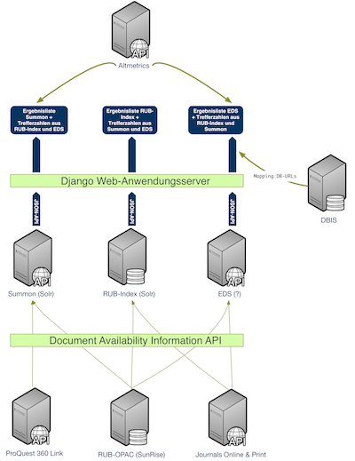
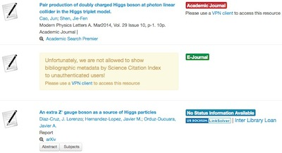

# "suchen" -- Ein Prototyp zum Vergleich von Discovery-Diensten

André Hagenbruch  
Universitätsbibliothek Bochum  
44780 Bochum  
andre.hagenbruch@rub.de

Miriam Heise  
Universitätsbibliothek Bochum  
44780 Bochum  
miriam.heise@rub.de

## Zusammenfassung
Wir beschreiben den Prototypen einer Webanwendung, die zwei unterschiedliche Discovery-Dienste und einen OPAC-basierten
Suchmaschinenindex integriert. Zunächst skizzieren wir die technische Architektur, geben dann einen Überblick über die
Metadaten und APIs der eingesetzten Discovery-Dienste und berichten im Anschluss von den Nutzererfahrungen, die wir aus
dem Feedback der Testpersonen gewonnen haben. Zuletzt geben wir einen Überblick über die Ergebnisse unseres Tests und
umreißen die Richtung, in die wir unsere Entwicklung fortführen wollen.

## Abstract
We describe a prototype web application that integrates two different discovery systems and an OPAC based search index.
Starting from an outline of the technical architecture we give an overview of the metadata and APIs encountered in the
discovery systems and then report on the user experience we gleaned from the feedback we got during our tests. Finally,
we present the conclusions we have drawn from our tests and indicate the directions in which we plan to further our
developments.

### Schlüsselwörter
Discovery-Dienst, Webanwendung, User Experience

### Keywords
Discovery Service, Web Application, User Experience

## Einleitung
Im Mai 2008 startete die Universitätsbibliothek Bochum das Projekt "Integriertes Bibliotheksportal", in dem eine Anwendung
entstehen sollte, um den Benutzern möglichst viele Datenquellen unter einer einheitlichen Oberfläche zur Recherche
auf Basis moderner Suchmaschinentechnologie anbieten zu können. Darüber hinaus sollte die Anwendung auch den
aktuellen Verfügbarkeitsstatus des jeweiligen Titels anzeigen und Benutzerfunktionalitäten wie z.B. Vormerkungen oder
Kontoverwaltung ermöglichen. Nachdem wir zunächst intensiv OCLC TouchPoint evaluiert hatten, zeichnete es sich ab,
dass wir damit nicht alle unsere Ziele erreichen würden. Parallel zu diesem Projekt haben wir eine auf
Open-Source-Software basierende Such-Plattform für die Hochschulbibliographie der RUB entwickelt, die so konzipiert war,
dass mit geringen Anpassungen unterschiedliche Datenquellen integriert werden konnten. Im September 2011 testeten wir mit
ProQuest zum ersten Mal die Möglichkeit, einen Discovery-Dienst in diese Plattform zu integrieren. Da ein Demonstrator
recht schnell implementiert werden konnte, entschlossen wir uns, die Produkte Summon von ProQuest und EDS von Ebsco
durch Integration über die angebotenen APIs sowie einen Suchmaschinenindex mit unseren Katalogdaten nebeneinander
zu evaluieren.  
Aufbauend auf den in Jansen et al. (2010)[^1] und Rochkind (2013)[^2] beschriebenen Ansätzen werden wir im Folgenden
die Architektur unseres Protoyps beschreiben, die angebotenen APIs und Metadaten und auch die Erfahrungen, welche die
UB-Mitarbeiter und die regulären Bibliotheksbenutzer mit diesen Diensten gemacht haben.

## Technische Architektur
Da es sich bei den Discovery-Diensten um Anwendungen handelt, die auf aktueller Suchmaschinentechnologie basieren,
werden die Daten des Bochumer OPAC in einem täglich ablaufenden ETL-Prozess in eine Apache Solr-Instanz überführt.
Während Summon ebenfalls Solr als Plattform nutzt, gibt es von Ebsco keine konkreten Informationen über die
eingesetzte Technik. Da bei ProQuest an dieser Stelle Open-Source-Software zum Einsatz kommt, kann man als Kunde gut den
zu erwartenden Funktionsumfang der Plattform einschätzen, da sie sowohl im Web als auch in der Literatur ausführlich
dokumentiert ist.  
Sowohl Summon als auch EDS bieten ihren Kunden die Wahl zwischen der Nutzung als SaaS (_Software as a Service_), bei dem
die Webanwendung bei den Firmen gehostet wird und nur in geringem Umfang an die lokalen Bedürfnisse (sowohl in Bezug auf
das Layout als auch die Funktionalitäten) angepasst werden kann, und der Einbindung des Dienstes über eine API
(_Application Programming Interface_). Da auch die Testumgebung möglichst neutral gestaltet werden sollte, wurde die
letztere Möglichkeit gewählt. Kernstück der Architektur war ein Django Webapplikationsserver, der sowohl die
Discovery-Dienste als auch den lokalen Index anspricht. Für das Oberfächenlayout kam das CSS-Framework _Bootstrap_[^3]
in einer nur rudimentär an das Corporate Design der Ruhr-Universität Bochum angepassten Form zum Einsatz. Darüber hinaus
stellte ein weiterer Django-Server eine Implementierung der _Document Availability Information API_ (DAIA)[^4],
die sowohl Verfügbarkeitsinformationen aus dem Lokalsystem als auch aus dem _Journals Online & Print_ (JOP)-Dienst der
DNB als auch dem 360 Link-Resolver von ProQuest hinter dieser plattformneutralen Programmierschnittstelle kapselte. War
es nicht möglich, über diese Dienste die Verfügbarkeit eines Titels zu ermitteln, wurde anhand der in den APIs der
Discovery-Dienste enthaltenen OpenURL-Informationen ein Link zur Fernleihe der DigiBib erzeugt. Damit sollte den
Nutzern die Möglichkeit gegeben werden, sofort anhand der Verfügbarkeit über die Relevanz eines Treffers zu
entscheiden. Eine weitere Entscheidungshilfe über die Relevanz des Treffers wurde über die Integration des Dienstes
_Altmetric_[^5] zu geben versucht, der Metriken über die Verwendung eines Artikels im Web aggregiert.  
  
Ein weiteres Desiderat dieses Tests sah vor, dass die Ergebnisse aus den Suchen in den Discovery-Diensten untereinander aber
auch zu unserem OPAC vergleichbar sein sollten. Daher haben wir die Trefferlisten so modelliert, dass eine Anfrage in
eines der drei Systeme die Trefferanzahl der jeweils anderen beiden sowie einen Link mit der Suchanfrage in den
jeweiligen Dienst lieferte. Dabei haben wir uns auf die reine Zeichenkette der Benutzeranfrage beschränkt, da die
Navigatoren der drei Systeme nicht aufeinander abbildbar waren. Während unser lokaler Index über Navigatoren für
Personen und Körperschaften verfügte, die sich aus der GND speisen, bot keiner der beiden Discovery-Dienste diese
Kategorien an, zumal in keinen von ihnen Normdaten integriert sind. Ein hilfreicher Navigator, den beide Dienste
bereitstellten, war die Möglichkeit, die Treffermenge auf _peer reviewed_-Artikel einschränken zu können. Da Summon diese
Kategorie auch in den einzelnen Datensätzen zur Verfügung stellte, konnte diese Information auch prominent in den
Treffern der Ergebnisliste dargestellt werden. Summon bietet darüber hinaus die Möglichkeit, enzyklopädische Informationen
-- aus der Encyclopedia Britannica oder der Wikipedia -- in die Trefferliste zu integrieren. EDS zog diese Funktionalität
zum Ende unserer Testperiode mit den _Research Starters_ nach, jedoch fehlte uns die Zeit, diese zu implementieren und
zu testen. Da in EDS die Zugehörigkeit eines Datensatzes zu der Datenbank, aus der er stammt, abzulesen war, haben wir
anhand des Datenbanktitels ein semi-automatisches Mapping der Titel auf die URLs aus DBIS erstellt, sodass Nutzer sofort
in der jeweiligen Datenbank weiterrecherchieren konnten. Da die Discovery-Dienste für sich in Anspruch nehmen, mit einer
Google-artigen Ein-Schlitz-Suche sehr gute Ergebnisse zu erzielen, haben wir auf die Implementierung einer erweiterten
Suche verzichtet.  
  

## Metadaten und APIs
ProQuest bezieht seine bibliographischen Daten direkt von den Verlagen, in EDS hingegen stammen diese von
Datenbankanbietern, woraus sich einerseits Unterschiede im Umgang mit den Metadaten ergeben, anderseits schlägt sich
dieser Umstand in zwei unterschiedlichen lizenzrechtlichen Modellen nieder. ProQuest setzt ein sogenanntes
Match-&-Merge-Verfahren ein, bei dem Dubletten von Titeldatensätzen verschiedener Anbieter zu einem einzigen Datensatz
verschmolzen und dadurch angereichert werden. In EDS bleiben die Dubletten im Index nebeneinander bestehen, den Nutzern
wird der umfangreichste Datensatz geliefert. ProQuest setzt also darauf, möglichst viele Informationen zu einem Titel in
einem Datensatz zu vereinen, Ebsco indes legt Wert darauf, dass die Integrität der Datensätze erhalten bleibt und diese
so angezeigt werden wie in den Datenbanken, aus denen sie stammen. Bei diesem Vorgehen besteht zwar die Möglichkeit, vom
Titel direkt in die entsprechende Datenbank zu wechseln, andererseits entgehen den Nutzern Informationen (z.B.
Schlagwörter), die sich nicht beim umfangreichsten Titel befinden und somit nicht angezeigt werden.
ProQuest ermöglicht seinen Nutzern im Übrigen durch passend zur Suchanfrage generierte Datenbankvorschläge den Übergang
in Datenbankangebote. Hierbei traten allerdings Probleme bei der Recherche mit deutschsprachigen Suchbegriffen auf, was
darin begründet liegt, dass die Datenbankvorschläge aus Voreinstellungen und Crowdsourcing generiert werden. So wurden
beispielsweise bei der Suche nach "epilepsy" zwei passende Datenbanken angeboten, während die Suche nach "Epilesie" keine
Datenbankvorschläge erzeugte.  
Aus dem unterschiedlichen Umgang der beiden Discovery-Anbieter mit den Metadaten ergeben sich auch lizenzrechtliche
Konsequenzen für die Nutzer dieser Angebote: Während die Metadaten in den Ergebnislisten in Summon vollständig angezeigt
werden, sodass die Nutzer sofort und auf einen Blick ihr Suchergebnis bewerten können, werden die Trefferlisten in EDS
unter Umständen nur authentifizierten Nutzern vollständig angezeigt. Technisch wäre die Anzeige der Metadaten in EDS
problemlos möglich, allein aufgrund vertraglicher Vereinbarungen sehen Nutzer, die nicht durch Authentifizierung oder
aufgrund ihrer IP-Adresse autorisiert sind, lediglich Stellvertreter anstelle der Titeldaten, was den
Benutzererwartungen an Suchanwendungen im Web fundamental widerspricht.  
  
Während sowohl Summon als auch EDS eine REST-basierte API anbieten, deren Daten im XML- bzw. im JSON-Format
ausgegeben werden, besteht der grundlegende Unterschied zwischen diesen beiden Angeboten darin, dass die
Summon-Webanwendung vollständig auf der API beruht, während die EDS-Oberfläche eine von den Programmierschnittstellen
losgelöste Entwicklung darstellt. Während ProQuest mit der Summon-API "dogfooding" betreibt, also den Einsatz des eigenen
Produkts als Basis für andere eigene Produkte, um zu zeigen, dass man von dessen Qualität und Leistungsvermögen überzeugt
ist, entstand die EDS-API eher im Nachgang zur Webanwendung.  
Obschon die Dokumentation der Summon-API vollständig im Web für jedermann einsehbar ist und dort sehr übersichtlich die
Komponenten und Parameter beschreibt, ist die EDS-API-Dokumentation nur Kunden zugänglich. Sie gliedert sich in zwei
Dokumente, eine nutzerorientierte Übersicht und eine Referenz, die zwar detailliert über die Parameter Auskunft gibt,
nicht jedoch über die Benennungen der im Index vorhandenen Felder, was dazu führte, dass wir erst im Laufe unserer
Implementierung durch Anschauung der konkreten Daten herausfinden konnte, in welchen Kategorien welche Werte zu
erwarten waren. Wenig hilfreich war in diesem Zusammenhang, dass ein und dieselbe Kategorie mehrere Bezeichnungen
besitzt. Ein Pluspunkt gegenüber der Summon-Dokumentation stellt hingegen die API-Console[^6] dar, in der man
unterschiedlichste Anfragen ausprobieren kann.  
Problematisch ist an der EDS-API allerdings, dass es vier Detailgrade bezüglich des Umfangs der Feldstruktur eines
Datensatzes gibt: „Title“ (nur der Titel), „Brief“ (Titel, Quelle und Schlagwörter) und „Detailed“ (Brief plus Abstract).
Während diese drei Ebenen der „Search“-Funktion der Ergebnisliste vorbehalten sind, gibt es den
vollumfänglichen Datensatz nur mit  der „Retrieve“-Funktion, die für die Volltrefferanzeige genutzt wird. Eine solche 
Unterscheidung gibt es in Summon nicht: Dort ist schon in der Ergebnisliste jeder Treffer im vollen Umfang enthalten, 
weshalb sich dadurch Oberflächen implementieren lassen, die ohne eine eigene Volltrefferanzeige auskommen. Das Fehlen 
einer einheitlichen Feldstruktur macht sich v.a. in der Volltrefferanzeige von EDS negativ bemerkbar: Würde man hier der 
Empfehlung von Ebsco folgen, einfach alle Elemente in der Reihenfolge auszugeben, wie sie in der Antwort des
Retrieve-Requests  geliefert werden, könnte man keine mehrsprachigen Oberflächen, keine Mashups mit anderen Diensten und
auch keine Verfügbarkeitsinformationen im Volltreffer realisieren.  Um eine flexiblere Lösung umsetzen zu können,
haben wir selbst ein Mapping aus den Daten abgeleitet und in einem iterativen Prozess ergänzt und verbessert.  
Beide APIs liefern als Antwortformate sowohl XML als auch JSON aus. Da sich letzteres einerseits in unserer Anwendung 
schneller verarbeiten ließ, andererseits von vielen als _das_ Datenformat für das Web angesehen wird, haben wir uns zur
Verwendung dieses Formats entschieden. Beiden Diensten ist gemein, dass sie für die Anzeige von Abstracts HTML in das
Ausgabeformat einbetten, was man dann (solange es wohlgeformt ist) zur Anzeige bringen oder aus dem Output entfernen
kann. Im Falle von EDS ist es allerdings dem Umstand geschuldet, dass dort das JSON aus dem XML-Format abgeleitet wird,
dass HTML-Entitäten so codiert sind, dass sie von gängigen Web-Frameworks falsch interpretiert werden und zur fehlerhaften
Darstellung in der Oberfläche führen. Darüber hinaus enthält das JSON in EDS einiger Schlagwortkategorien XML, das nur
für das XML-Ausgabeformat Sinn macht. Somit wird unnötig zusätzlicher Aufwand für die Bereinigung der Daten innerhalb
der Webanwendung generiert. Insgesamt ist festzuhalten, dass der Einsatz der EDS-API im Vergleich zur Summon-API in ca.
10% umfangreicherem Code resultiert, den man als Benutzer der API schreiben und pflegen muss.

## Nutzererfahrungen
Mit der Einbindung der beiden Discovery-Dienste EDS und Summon neben dem suchmaschinenbasierten OPAC unter einer
gemeinsamen Benutzeroberfläche sollten den Nutzern nicht nur möglichst viele Datenquellen unter einer einheitlichen
Oberfläche angeboten werden, sondern auch der Vergleich der beiden Discovery-Systeme sollte erleichtert und
transparenter gestaltet werden.  
Auf der Startseite der UB hatten die Nutzer zwei Möglichkeiten zum Einstieg in "suchen": zum einen über einen
Suchschlitz,  über den der RUB-Index durchsucht wurde. In der Trefferliste konnten die Nutzer über die Reiter im Header
zwischen den drei Angeboten wechseln. Zum anderen konnte "suchen" über einen Link auf der Startseite der UB geöffnet
werden. Umrahmt wurden Suchschlitz und Link von einem erklärenden Text, in dem gleichzeitig um Nutzerfeedback gebeten
wurde. Hierbei kam der Online-Dienst _Disqus_[^7] zum Einsatz, die Betreibern und Nutzern von Websites eine zentralisierte
Diskussions-Plattform bietet. Zu einem späteren Zeitpunkt wurden gezielt Studierende angeschrieben und um Feedback
gebeten, wobei es insbesondere um die Entscheidung zugunsten eines der beiden Discovery-Services ging.  
Leider gab es von Studierenden kaum Rückmeldungen zu "suchen". Das meiste Feedback kam aus der UB selbst, und zwar aus
den Fachreferaten, vom Zeitschriftenteam, dem Schulungsteam sowie den Auszubildenden. Geisteswissenschaftliche Themen
bildeten den größten Teil des Feedbacks, wenngleich es vereinzelt Rückmeldungen zu naturwissenschaftlichen Recherchen
gab. Im Vordergrund standen dabei weniger Usability-Aspekte als vielmehr die Qualität der angebotenen Inhalte. Alles in
allem konnte das abgegebene Feedback nicht als repräsentativ angesehen und dementsprechend nicht statistisch ausgewertet
werden, jedoch waren gewisse Tendenzen zu beobachten, die im Folgenden kurz aufgezeigt werden sollen.  
Die Studierenden und die Auszubildenden lobten die einfache Bedienung und die Übersichtlichkeit der Anwendungsoberfläche.
Das Angebot wurde als optisch ansprechender als der klassische OPAC empfunden. Als besonders positiv hervorgehoben wurde
von dieser Zielgruppe der Umstand, dass in den Discovery-Angeboten mit einer Suchanfrage gleichzeitig verschiedene
Medienformen gefunden werden, die zuvor mühsam separat -- Bücher in Katalogen, Aufsätze in Datenbanken -- ermittelt werden
und auf ihre Verfügbarkeit überprüft werden mussten. In "suchen" war es nicht nur möglich, zwischen den Ergebnislisten
der beiden Discovery-Dienste sowie der OPAC-Daten hin- und herzuwechseln, sondern auch die Verfügbarkeit wird direkt in
der Kurztrefferliste angezeigt. Die Nutzer müssen also nicht die Vollanzeige jedes einzelnen Titels überprüfen, sondern
sehen sofort, welche Titel für sie verfügbar sind. Studierende und Auszubildende sprachen sich mehrheitlich dafür aus,
dass die UB einen Discovery-Dienst anbieten sollte, lediglich aus dem Fach Mathematik kam die Rückmeldung, dass dort
kein Bedarf an Discovery bestehe -- eine Position, die in der UB von den meisten Fachreferenten der
naturwissenschaftlichen Fächer geteilt wurde. In den geisteswissenschaftlichen Fächern wurden die Vorteile eines
Angebotes, das verteilte Quellen zusammenführt, gesehen, allerdings wurde die intuitiv benutzbare Oberfläche mit
Skepsis betrachtet und der Wunsch nach einer Recherchemaske für eine erweiterte Suche geäußert. Vor allem aber wurden
Bedenken bezüglich der inhaltlichen Qualität der Discovery-Angebote bzw. des Relevanzrankings formuliert.  
Beide Discovery-Dienste unter derselben Oberfläche wie den OPAC anzubieten war insofern sinnvoll, als dass
deckungsgleiche Strukturen auch als solche identifiziert werden konnten und Unterschiede zwischen den Produkten
deutlicher hervortraten. Am auffallendsten waren zunächst aus den APIs resultierende Unterschiede, u.a. der Umgang mit
Dubletten[^8], die -- in EDS aufgrund fehlender Dokumentation von Feldern -- problematische Darstellung von Abstracts und
eine unterschiedliche Facettierung der Ergebnismenge. In Summon haben die Nutzer die Möglichkeit, nach _peer reviewed_,
Schlagwort, Fachbereich, Publikationstyp, Sprache und Jahr zu filtern. In EDS wird die Treffermenge teilweise 
nach anderen Kriterien facettiert: Nutzer können hier nach _peer reviewed_, Schlagwort, Veröffentlichung (d.h. dem
übergeordneten Titel), Publikationstyp, Sprache, Verlag und Datenquelle filtern; ein Navigator für das Erscheinungsjahr
existiert bedauerlicherweise nicht bzw. ist dieser nur in der originären EDS-Oberfläche vorhanden -- über die EDS-API
werden diese Informationen nicht geliefert. Das Fehlen dieses Navigators wurde von den Nutzern kritisiert, die Filter
Veröffentlichung und Verlag wurden als überflüssig charakterisiert. Der Link zu den Datenbanken fand hingegen Anklang,
ebenso wie der Schlagwort-Navigator.  
Hinsichtlich der Zusatzfeatures, die in die Discovery-Dienste eingebunden werden können, sticht vor allem die Möglichkeit
hervor, in Summon Kontextinformationen in Form von gemeinfreien, offen lizenzierten Inhalten (Wikipedia) zur Recherche
anzubieten. Die Nutzer (in erster Linie Studierende und Auszubildende) äußerten sich positiv über dieses Feature.

## Fazit
Durch die Integration der unterschiedlichen Angebote in einer Webanwendung mit einer gemeinsamen Suchoberfläche war es
möglich, die getesteten Dienste unabhängig von ihrem äußeren Design zu testen und strukturelle Unterschiede sichtbar zu
machen, um die dabei gemachten Beobachtungen für eine Entscheidungsfindung zu nutzen. Eine technische Lösung wie der hier
vorgestellte Prototyp unterstützt kurzfristig den Vergleich und die Evaluierung unterschiedlicher Dienste, langfristig
ist jedoch eine Lösung wünschenswert, in der die Nutzer nicht via Reiter zwischen den Datenquellen hin- und herwechseln
müssen, sondern in der möglichst alle Daten in einem einzigen Index integriert und somit auch gemeinsam durchsuch- und
facettierbar sind. Der nächste Schritt wäre also -- nach der Entscheidung für eines der beiden Discovery-Systeme -- die
Integration der OPAC-Daten in den Index des gewählten Discovery-Dienstes. Eine solche Integration ist bei beiden
getesteten Discovery-Systemen prinzipiell möglich, würde sich jedoch aufgrund der Metadatenstrukturen und der
API-Architektur mit Summon unkomplizierter gestalten als in EDS. Unabhängig von der Entscheidung hinsichtlich der
Discovery-Services wird "suchen" auch in Zukunft weiterentwickelt werden, um den Nutzern einerseits die OPAC-Daten auf
der Basis von Suchmaschinentechnologie zugänglich zu machen und ihnen durch Mashups mit anderen Diensten Funktionalitäten
anzubieten, die über den traditionellen OPAC hinausgehen. Andererseits müssen grundlegende Benutzerfunktionalitäten
wie Vormerkung oder Verlängerung implementiert werden, sodass ein solcher Dienst den lokalen OPAC ablösen könnte.
Es stellt sich zudem die Frage, ob weitere Inhalte in den RUB-Index eingebunden werden sollen bzw. welche Inhalte dabei 
relevant wären und den Nutzern einen Mehrwert böten.  
Führt man den Gedanken der Integration möglichst vieler Datenquellen in ein einziges Angebot weiter, kann ein
Discovery-Dienst allerdings keine endgültige Lösung sein, da es sich bei Discovery-Diensten ebenfalls um nichts anderes
handelt als die Datensilos[^9], mit denen Bibliotheken seit Jahrzehnten operieren -- wenngleich diese herkömmliche Kataloge
und Datenbanken in ihren Dimensionen um ein Vielfaches übertreffen. Um den jetzigen Zustand der verteilten Suche 
in unterschiedlichen Informationsangeboten konsequent zu überwinden, werden Bibliotheken Webstandards, Linked (Open) Data
und Suchmaschinentechnologie nicht nur in ihre eigenen Anwendungen einbringen müssen, sondern sich mit ihren Metadaten
und Informationsangeboten wie Katalogen und Datenbanken ins Web begeben müssen. Auch wenn mit Discovery-Systemen eine
Recherche im Web simuliert wird -- letztlich wird erst im Web selbst eine wirklich integrierte Suche über einen einzigen
Index möglich sein.

[^1]: Jansen, Heiko; Kemner-Heek, Kirstin; Schweitzer, Roswitha: Konkurrenzanalyse ausgewählter kommerzieller Suchindizes.
<http://www.hbz-nrw.de/dokumentencenter/veroeffentlichungen/suchindizes.pdf> [Zugriff: 15. Juli 2014].
[^2]: Rochkind, Jonathan: A Comparison of Article Search APIs via Blinded Experiment and Developer Review.
<http://journal.code4lib.org/articles/7738> [Zugriff: 15. Juli 2014].
[^3]: Twitter: Bootstrap. <http://getbootstrap.com/2.3.2/> [Zugriff: 15. Juli 2014].
[^4]: Voss, Jacob; Reh, Uwe: Document Availability Information API (DAIA). <http://gbv.github.io/daiaspec/daia.html>
[Zugriff: 15. Juli 2014].
[^5]: Altmetric: Altmetric API documentation. <https://api.altmetric.com/> [Zugriff: 15. Juli 2014].
[^6]: Ebsco: EDS API Console. <https://eds-api.ebscohost.com/Console/> [Zugriff: 15. Juli 2014].
[^7]: Disqus: Disqus - The Web's Community of Communities. <https://disqus.com/> [Zugriff: 15. Juli 2014].
[^8]: In beiden Discovery-Systemen traten Dubletten auf; kritisiert wurde in erster Linie deren Häufung in EDS.
[^9]: Vgl. zu einer daten- statt containerbasierten Haltung auch Koster, Lukas: Old silos, new silos, no silos. 
SWIB 2012, Köln, 26.-28. November 2012. <http://de.slideshare.net/lukask/old-silos-new-silos-no-silos> [Zugriff: 15. Juli 2014].